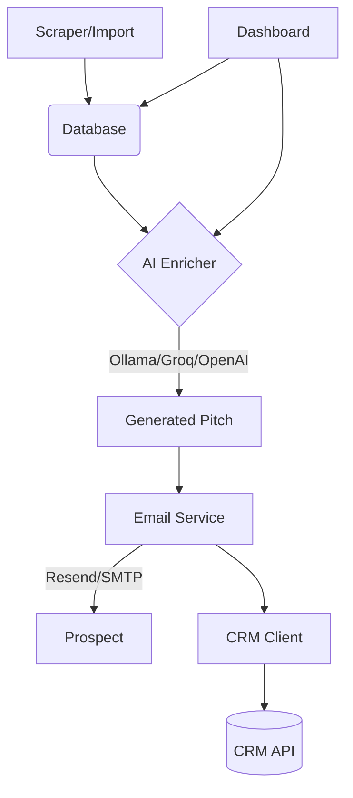

# AI Lead CRM Agent

AI Lead CRM Agent is an automated pipeline for generating AI-enhanced outreach emails, managing CRM contacts, and tracking campaign interactions.

## Architecture



## Features
- AI-driven personalized outreach pitches.
- Multiple LLM providers support (Ollama, Groq, OpenAI).
- Integrated Email sender via Resend (with SMTP fallback).
- Built-in CRM synchronization.
- Persistent local SQLite storage.
- Interactive Dashboard.

## Quick Start

### Prerequisites
- Python 3.11+
- [Ollama](https://ollama.ai) (optional, if using local models)
- Resend API key (optional)

### Setup
1. Clone the repository:
   ```bash
   git clone https://github.com/your-username/ai-lead-crm-agent.git
   cd ai-lead-crm-agent
   ```
2. Set up the virtual environment:
   ```bash
   python -m venv venv
   source venv/bin/activate  # On Windows: venv\Scripts\activate
   ```
3. Install dependencies:
   ```bash
   pip install -r requirements.txt
   ```
4. Configure `.env` file (see Environment Variables).
5. Run the application dashboard:
   ```bash
   python dashboard.py
   ```

## Environment Variables

| Variable | Description | Default |
| -------- | ----------- | ------- |
| `LLM_PROVIDER` | Choose from `ollama`, `groq`, `openai` | `ollama` |
| `RESEND_API_KEY` | Resend API Key for emails | (Required for Resend) |
| `DASHBOARD_AUTH_TOKEN`| Token for dashboard access | (Required) |
| `BUSINESS_ADDRESS` | Address to append for CAN-SPAM | (Required) |
| `CRM_API_KEY` | Key for CRM client integration | |
| `DB_PATH` | Path to SQLite database | `leads.db` |
| `SMTP_HOST` | Fallback SMTP Host | |
| `SMTP_PORT` | Fallback SMTP Port | `587` |
| `SMTP_USER` | Fallback SMTP User | |
| `SMTP_PASS` | Fallback SMTP Password | |

## Dashboard Usage
The dashboard is accessible via `http://localhost:5050`. It allows you to:
- View imported leads.
- Trigger AI pitch generation.
- Send test or batch emails.
- Monitor CRM sync status.

## API Endpoints
If running in API mode, the dashboard exposes:
| Endpoint | Method | Description |
| -------- | ------ | ----------- |
| `/api/leads` | GET | List all leads |
| `/api/leads` | POST | Add a new lead |
| `/api/leads/<id>` | GET | Get a specific lead |
| `/api/enrich` | POST | Generate pitch for lead |
| `/api/send` | POST | Dispatch email to lead |

## Testing
We use `pytest` for all unit and integration testing. Mocking is provided for external APIs like Resend and CRM.
```bash
pip install -r requirements.txt
pytest tests/ -v --tb=short
```

## Docker Deployment
Easily deploy using Docker Compose:
```bash
docker-compose up -d --build
```
This spins up the application on port `5050` with a mapped volume for the SQLite database to persist data.

## Project Structure
```text
.
├── config.py           # Settings and Environment setup
├── dashboard.py        # Web UI and Endpoints
├── database.py         # SQLite interactions
├── enricher.py         # AI Pitch Generation
├── email_service.py    # Resend and SMTP Mailer
├── crm_client.py       # CRM Integration
├── main.py             # CLI Entry Point
├── Dockerfile          # Docker setup
├── docker-compose.yml  # Docker compose config
├── tests/              # Pytest Test suite
└── README.md           # Documentation
```

## Contributing
1. Fork the repo
2. Create a feature branch (`git checkout -b feature/xyz`)
3. Commit your changes (`git commit -m 'Add xyz'`)
4. Push to the branch (`git push origin feature/xyz`)
5. Open a Pull Request

## License
MIT License
